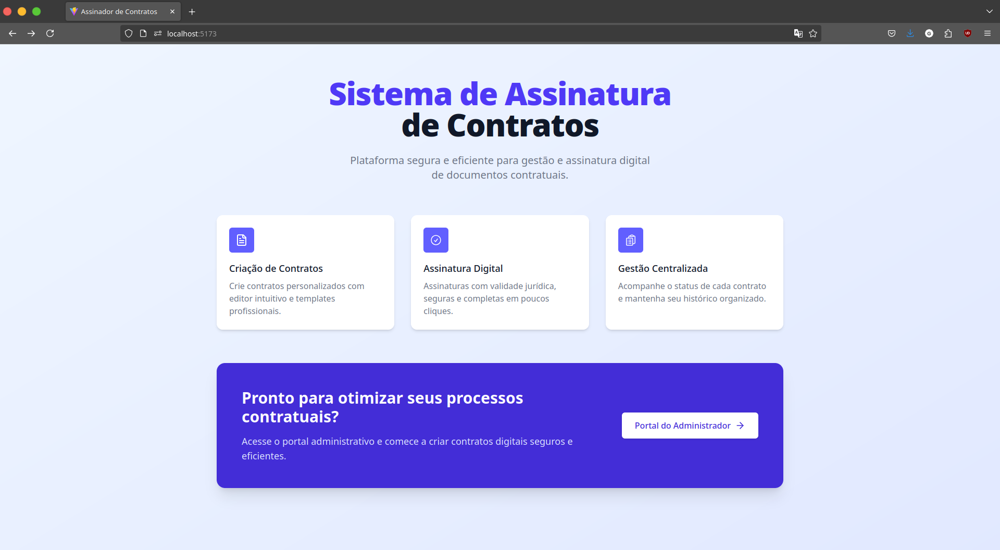
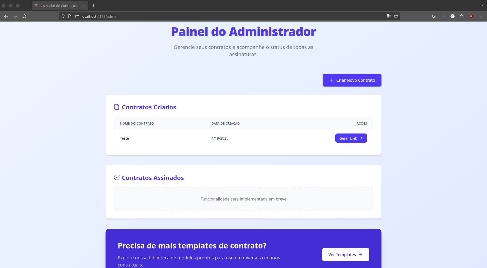
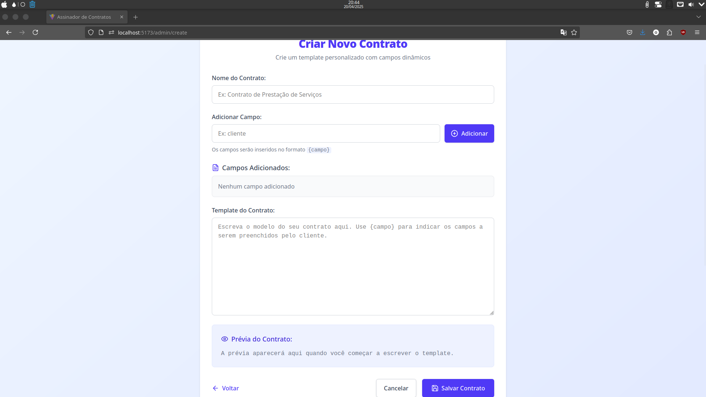
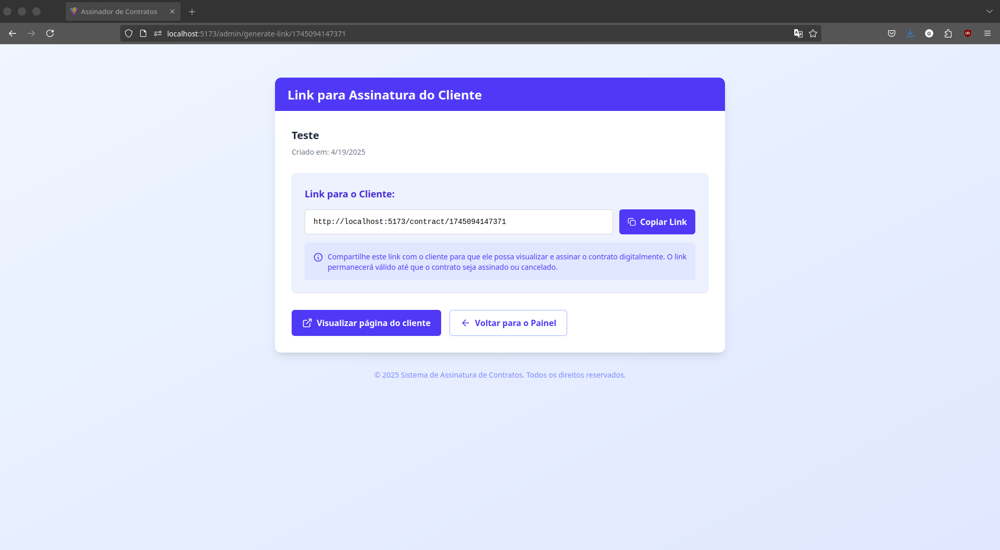
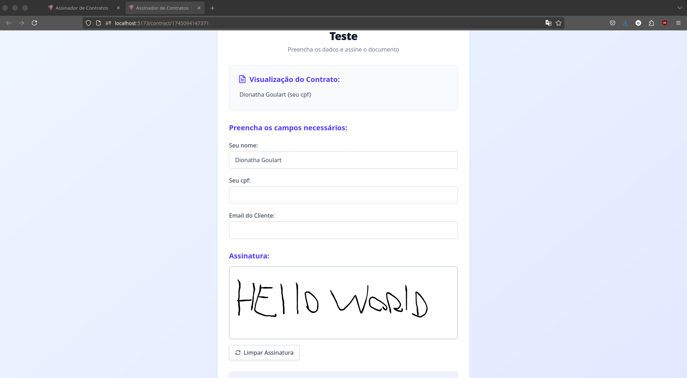

# Sistema de Assinatura de Contratos (em desenvolvimento)

## 📝 Sobre o Projeto

Sistema de Assinatura de Contratos é uma plataforma web segura e eficiente para gestão e assinatura digital de documentos contratuais. A aplicação permite criar, personalizar, compartilhar e assinar contratos digitalmente, simplificando todo o processo de gestão contratual.

## ✨ Funcionalidades Atuais

- Painel administrativo para gestão centralizada de contratos
- Criação de contratos personalizados com campos dinâmicos
- Geração de links compartilháveis para assinatura
- Interface intuitiva para assinatura digital
- Visualização em tempo real do contrato
- Envio automático dos contratos assinados por email
- Design responsivo para dispositivos móveis e desktop

## 🖼️ Screenshots

### Tela Inicial



### Painel de Administrador



### Criar Novo Contrato



### Link para Cliente Assinar



### Página de Assinatura do Cliente



## 🛠️ Tecnologias Utilizadas

### Frontend

- React.js com Vite
- Tailwind CSS para estilização
- HTML Canvas para captura de assinaturas
- JavaScript para manipulação de DOM e eventos

### Backend

- Node.js
- Express para API RESTful
- Nodemailer para envio automático de emails
- CORS para gerenciamento de requisições entre domínios
- dotenv para gerenciamento de variáveis de ambiente

## ⚙️ Instalação e Configuração

### Pré-requisitos

- Node.js (v14+)
- npm ou yarn

### Configuração do Backend

1. Clone o repositório:

```bash
git clone https://github.com/seu-usuario/contrato-digital.git
cd signature-React
cd backend
```

2. Instale as dependências:

```bash
npm install
```

3. Crie um arquivo `.env` na raiz do projeto backend com as seguintes variáveis:

```
EMAIL_FROM=seu-email@provedor.com
EMAIL_PASS=sua-senha-ou-app-password
```

**Observação sobre senhas de aplicativos:**

- App password Gmail: https://myaccount.google.com/apppasswords
- App password Microsoft: https://account.live.com/proofs/manage/additional
- App password Yahoo: https://login.yahoo.com/account/security

4. Inicie o servidor de desenvolvimento:

```bash
node index.js
```

### Configuração do Frontend

1. Instale as dependências:

```bash
cd frontend
npm install
```

2. Crie um arquivo `.env` na raiz do projeto frontend com as seguintes variáveis:

```
VITE_API_URL=http://localhost:3001
VITE_EMAIL_FROM=seu-email@provedor.com
```

3. Inicie o servidor de desenvolvimento:

```bash
npm run dev
```

## 🔌 API Endpoints

### POST /send-contract

Envia o contrato assinado por email.

**Parâmetros:**

```json
{
  "pdfBase64": "Base64_do_PDF_assinado",
  "clientEmail": "email_do_cliente@exemplo.com",
  "adminEmail": "email_do_administrador@exemplo.com"
}
```

**Resposta de Sucesso:**

```json
{
  "message": "E-mail enviado com sucesso!"
}
```

## 🚀 Implementações Futuras

### Melhorias na Gestão de Contratos

- Sistema de autenticação e autorização com diferentes níveis de acesso
- Histórico completo de versões e alterações dos contratos
- Sistema de notificações para contratos pendentes de assinatura
- Implementação de dashboards analíticos com métricas e KPIs de contratos
- Filtros avançados e busca de contratos por diferentes parâmetros

### Recursos de Assinatura e Segurança

- Integração com certificados digitais ICP-Brasil
- Autenticação em duas etapas para assinatura (SMS/Email)
- Validação de documentos por biometria facial ou digital
- Blockchain para garantir imutabilidade e validade jurídica dos contratos
- Criptografia avançada para armazenamento seguro dos documentos

### Personalização e Templates

- Biblioteca expandida de modelos de contratos para diversos segmentos
- Editor avançado de texto com formatação completa para templates
- Possibilidade de upload de documentos externos para assinatura
- Campos condicionais baseados em respostas anteriores
- Múltiplos idiomas e traduções automáticas

### Integrações e Fluxo de Trabalho

- Integração com CRMs, ERPs e sistemas de gestão empresarial
- Fluxos de aprovação personalizados com múltiplos níveis
- Integração com serviços de assinatura eletrônica certificados
- API completa para integração com sistemas de terceiros
- Webhooks para notificações em tempo real sobre mudanças de status

### Usabilidade e Experiência do Usuário

- Aplicativo móvel nativo para iOS e Android
- Interface adaptada para tablets e dispositivos de diferentes tamanhos
- Modo offline com sincronização posterior
- Tutoriais interativos e tour guiado para novos usuários
- Personalização da interface com temas e marca do cliente (white label)

### Armazenamento e Compliance

- Armazenamento em nuvem com backup automático
- Conformidade com LGPD, GDPR e outras regulamentações de proteção de dados
- Políticas de retenção de documentos configuráveis
- Auditoria completa de acessos e modificações
- Relatórios de compliance para fins regulatórios

## 👤 Autor

[Meu Linkedin](https://www.linkedin.com/in/dionathagoulart/)

---

**Nota:** Este projeto está em desenvolvimento ativo e novas funcionalidades estão sendo adicionadas.
