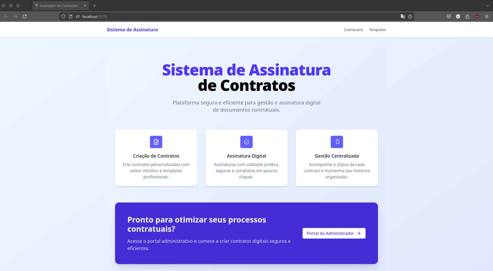
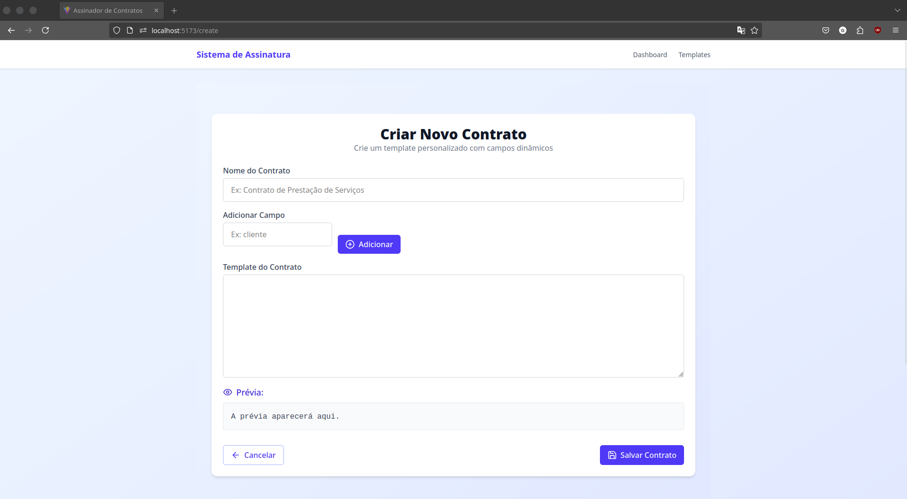
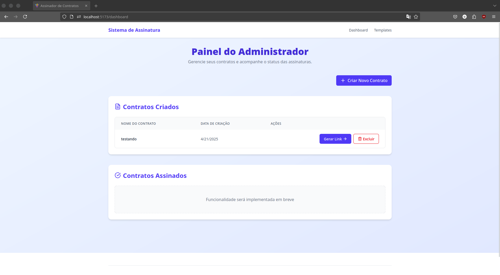

<div align="center">

# 📝 Sistema de Assinatura de Contratos

**Plataforma segura e eficiente para gestão e assinatura digital de documentos contratuais**

[](https://reactjs.org/)
[](https://nodejs.org/)
[](https://tailwindcss.com/)
[](https://vitejs.dev/)
[](LICENSE)

</div>

---

## 📸 Preview

<div align="center">


<p><em>Página inicial com apresentação das funcionalidades principais</em></p>


<p><em>Interface para criação de contratos personalizados</em></p>


<p><em>Página do cliente para assinatura digital</em></p>


<p><em>Painel administrativo para gestão de contratos</em></p>

</div>

---

## ✨ Funcionalidades

### 🎯 Principais Características

- **📝 Criação de Contratos** - Editor intuitivo com templates personalizáveis e campos dinâmicos
- **✍️ Assinatura Digital** - Canvas de assinatura com validação e armazenamento seguro
- **📧 Envio Automático** - Envio de contratos assinados por email para cliente e administrador
- **📄 Geração de PDF** - Conversão automática para PDF com assinatura integrada
- **🔗 Links Personalizados** - Geração de links únicos para cada contrato
- **📊 Dashboard Admin** - Painel completo para gestão e acompanhamento de contratos
- **💾 Armazenamento Local** - Persistência de dados no localStorage do navegador
- **📱 Interface Responsiva** - Design adaptável para desktop, tablet e mobile

### 🛠️ Funcionalidades Técnicas

- **⚡ Vite + React 19** - Build tool moderno com React de última geração
- **🎨 Tailwind CSS 4** - Framework CSS utilitário para design responsivo
- **🖊️ Signature Canvas** - Biblioteca para captura de assinaturas digitais
- **📧 Nodemailer** - Serviço de email com templates Handlebars
- **📄 jsPDF** - Geração de PDFs no frontend
- **🔄 React Router** - Navegação SPA com roteamento dinâmico

---

## 🏗️ Arquitetura do Projeto

```
signature-React/
├── 📁 frontend/              # Aplicação React
│   ├── src/
│   │   ├── app/
│   │   │   ├── pages/        # Páginas da aplicação
│   │   │   └── routes/       # Configuração de rotas
│   │   ├── lib/
│   │   │   ├── components/   # Componentes reutilizáveis
│   │   │   ├── hooks/        # Custom hooks
│   │   │   ├── services/     # Serviços (API, PDF, Email)
│   │   │   └── utils/        # Utilitários
│   │   └── assets/           # Recursos estáticos
│   ├── package.json
│   └── vite.config.js
├── 📁 backend/               # API Node.js
│   ├── src/
│   │   ├── controllers/      # Controladores de rotas
│   │   ├── middlewares/      # Middlewares de validação
│   │   ├── routes/           # Definição de rotas
│   │   ├── services/         # Serviços de negócio
│   │   ├── config/           # Configurações
│   │   └── templates/        # Templates de email
│   ├── package.json
│   └── server.js
└── 📁 imgs/                  # Screenshots do projeto
```

---

## 📄 Páginas e Seções

### 🏠 Home

- **Hero Section** - Apresentação principal com call-to-action
- **Features Grid** - Cards com funcionalidades principais
- **CTA Section** - Botão para acesso ao painel administrativo

### 👨‍💼 Admin Dashboard

- **Lista de Contratos** - Visualização de todos os contratos criados
- **Ações Rápidas** - Criar novo contrato e gerar links
- **Status dos Contratos** - Acompanhamento do progresso

### ✏️ Contract Creator

- **Formulário de Criação** - Nome e template do contrato
- **Campos Dinâmicos** - Adição de campos personalizáveis
- **Prévia em Tempo Real** - Visualização do template
- **Validação** - Verificação de campos obrigatórios

### 🔗 Generate Client Link

- **Link Único** - Geração de URL personalizada
- **Compartilhamento** - Opções para envio do link
- **QR Code** - Código para acesso mobile

### 📝 Client Contract

- **Formulário Dinâmico** - Campos baseados no template
- **Canvas de Assinatura** - Área para assinatura digital
- **Validação Completa** - Verificação de todos os campos
- **Processamento** - Geração de PDF e envio por email

### 📋 Signed Contracts List

- **Histórico** - Lista de contratos assinados
- **Download** - Acesso aos PDFs gerados
- **Filtros** - Busca e organização

---

## 🛠️ Tecnologias Utilizadas

### Frontend

- **React 19.1.0** - Biblioteca para interfaces de usuário
- **React Router DOM 7.5.1** - Roteamento para aplicações React
- **Tailwind CSS 4.1.4** - Framework CSS utilitário
- **Lucide React 0.501.0** - Biblioteca de ícones
- **React Signature Canvas 1.1.0** - Componente para assinaturas
- **jsPDF 3.0.1** - Geração de PDFs no cliente

### Backend

- **Node.js** - Runtime JavaScript
- **Express 5.1.0** - Framework web para Node.js
- **Nodemailer 6.10.1** - Cliente de email para Node.js
- **Handlebars 4.7.8** - Engine de templates
- **CORS 2.8.5** - Middleware para Cross-Origin Resource Sharing
- **dotenv 16.5.0** - Carregamento de variáveis de ambiente

### Ferramentas de Desenvolvimento

- **Vite 6.3.1** - Build tool e dev server
- **ESLint 9.22.0** - Linter para JavaScript
- **PostCSS 8.5.3** - Processador de CSS
- **Autoprefixer 10.4.21** - Prefixos CSS automáticos
- **Nodemon 3.1.9** - Monitor de arquivos para Node.js

### Deploy e CI/CD

- **Vercel** - Plataforma de deploy para frontend
- **GitHub** - Controle de versão e CI/CD

### Integrações

- **Email Service** - Envio automático de contratos
- **PDF Generation** - Conversão de documentos
- **Local Storage** - Persistência de dados no navegador

---

## 🚀 Como Executar

### Pré-requisitos

- Node.js 18+ instalado
- NPM ou Yarn
- Conta de email para configuração do serviço

### Instalação

```bash
# Clone o repositório
git clone https://github.com/DionathaGoulart/signature-React.git

# Entre no diretório
cd signature-React

# Instale as dependências do frontend
cd frontend
npm install

# Instale as dependências do backend
cd ../backend
npm install
```

### Scripts Disponíveis

```bash
# Frontend (dentro da pasta frontend/)
npm run dev          # Servidor de desenvolvimento
npm run build        # Build para produção
npm run preview      # Preview do build
npm run lint         # Verificação de código

# Backend (dentro da pasta backend/)
npm start            # Servidor de produção
npm run dev          # Servidor de desenvolvimento com nodemon
```

### Execução Completa

```bash
# Terminal 1 - Backend
cd backend
npm run dev

# Terminal 2 - Frontend
cd frontend
npm run dev
```

---

## 🧪 CI/CD e Qualidade

### GitHub Actions

O projeto possui workflow automatizado de CI/CD:

- **Build Frontend** - Compilação e verificação do código React
- **Lint Check** - Verificação de qualidade de código
- **Deploy Automático** - Deploy na Vercel em push para main

### Ferramentas de Qualidade

- **ESLint** - Análise estática de código JavaScript
- **React Hooks Plugin** - Regras específicas para hooks
- **Vite** - Build tool otimizado para desenvolvimento

---

## 🚀 Deploy

### Deploy Automático (Vercel)

O projeto está configurado para deploy automático na Vercel:

- **Produção**: Deploy automático na branch `main`
- **Preview**: Deploy automático em Pull Requests
- **URL**: `https://signature-react.vercel.app`

### Configuração Vercel

- **Framework**: Vite
- **Runtime**: Node.js 18
- **Build Command**: `npm run build`
- **Output Directory**: `dist`
- **Install Command**: `npm install`

### Configuração Automática

1. Conecte seu repositório no Vercel Dashboard
2. Configure as variáveis de ambiente necessárias
3. O deploy acontece automaticamente via GitHub Actions

### Workflows GitHub Actions

O projeto possui workflow automatizado:

- **CI/CD** - Build, testes e deploy automático

### Deploy Manual

```bash
# Build para produção
cd frontend
npm run build

# Deploy via Vercel CLI
npx vercel --prod
```

---

## 📊 Performance

- **Bundle Size**: Otimizado com Vite e tree-shaking
- **Loading Time**: Carregamento rápido com code splitting
- **Responsive Design**: Interface adaptável para todos os dispositivos
- **SEO Friendly**: Meta tags e estrutura semântica

---

## 🔧 Configuração

### Variáveis de Ambiente

Crie um arquivo `.env` na pasta backend:

```env
# Email Configuration
EMAIL_HOST=smtp.gmail.com
EMAIL_PORT=587
EMAIL_USER=seu-email@gmail.com
EMAIL_PASS=sua-senha-app
EMAIL_FROM=seu-email@gmail.com

# Server Configuration
PORT=3001
NODE_ENV=development
```

### Personalização

- **Templates de Email**: Edite `backend/src/templates/email-template.html`
- **Estilos**: Configure `frontend/tailwind.config.js`
- **Componentes**: Modifique os arquivos em `frontend/src/lib/components/`
- **Páginas**: Adicione novas páginas em `frontend/src/app/pages/`
- **API Routes**: Configure em `backend/src/routes/`

---

## 📱 Responsividade

O sistema é totalmente responsivo e otimizado para:

- **📱 Mobile** (320px - 768px)
- **📱 Tablet** (768px - 1024px)
- **💻 Desktop** (1024px - 1440px)
- **🖥️ Large Desktop** (1440px+)

---

## ♿ Acessibilidade

- **Navegação por Teclado** - Suporte completo para navegação via teclado
- **Contraste Adequado** - Cores com contraste suficiente para leitura
- **Labels Semânticos** - Formulários com labels apropriados
- **ARIA Attributes** - Atributos para leitores de tela
- **Focus Management** - Gerenciamento adequado do foco

---

## 📄 Licença

**⚠️ ATENÇÃO: Este projeto é de uso exclusivo e pessoal.**

### Direitos Reservados

Este software e sua documentação são propriedade exclusiva do autor e estão protegidos por direitos autorais. É **expressamente proibido**:

- ❌ **Copiar** o código fonte
- ❌ **Modificar** sem autorização
- ❌ **Distribuir** o software
- ❌ **Usar** para fins comerciais
- ❌ **Criar trabalhos derivados**
- ❌ **Fazer engenharia reversa**

### Uso Permitido

- ✅ **Visualizar** o código para fins educacionais
- ✅ **Estudar** a implementação para aprendizado
- ✅ **Inspirar-se** nas ideias e conceitos
- ✅ **Fazer fork** apenas para estudo pessoal

### Consequências

A violação desta licença resultará em:

- Ação legal imediata
- Remoção do conteúdo infrator
- Danos e prejuízos conforme a lei

**© 2025 Dionatha Goulart. Todos os direitos reservados.**

---

## 📞 Contato

**Desenvolvedor**: Dionatha Goulart  
**Email**: dionatha.work@gmail.com  
**Portfolio**: https://dionatha.com.br/  
**GitHub**: https://github.com/DionathaGoulart  
**Linkedin**: https://www.linkedin.com/in/dionathagoulart/

---

<div align="center">

**Feito by Dionatha Goulart**

</div>
